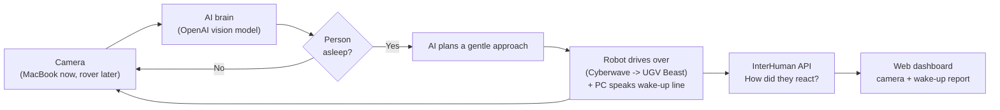
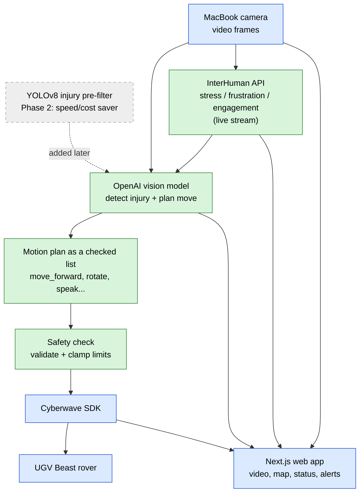
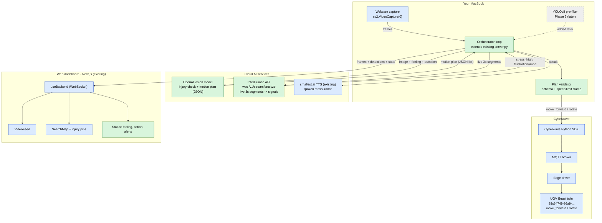
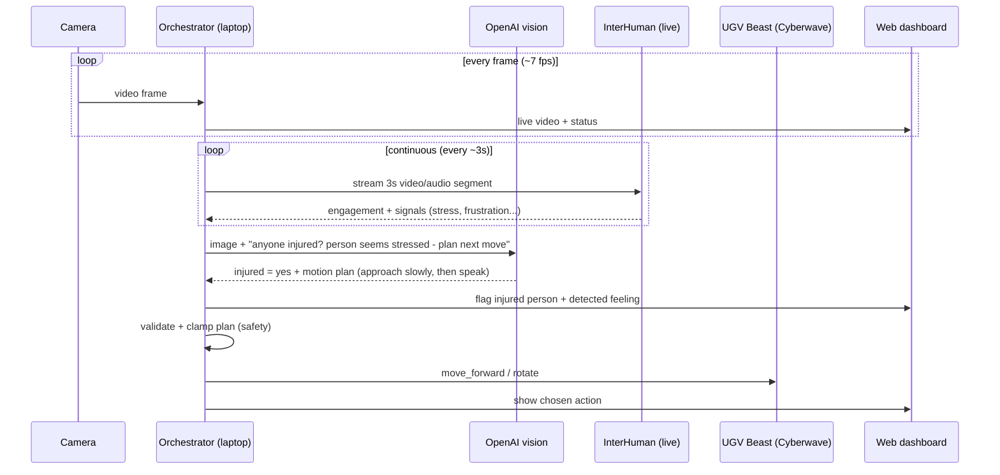

# RobotHelper — Pipeline & Architecture Guide

A plain-English guide to **how this project works**. Written to be readable
without a technical background.

> **Scope note (current):** RobotHelper is now a **wake-up robot**. The OpenAI
> vision planner decides whether a person is **asleep**; if so the rover drives
> over to **wake them up** (the wake-up line plays through the PC/browser audio),
> and the dashboard reports how groggy they look and how they **reacted** (via
> InterHuman). The pipeline below was originally written for an "injured-person
> rescue" demo — the plumbing (camera → OpenAI planner → InterHuman → safety →
> Cyberwave → dashboard) is identical; only the *question the brain asks*
> ("injured?" → "asleep?") and the dashboard (map/pins → camera + report) changed.

> Tip: view this file in a Markdown preview (VS Code, GitHub, etc.) so the
> mermaid diagrams render as pictures instead of code.

---

## Decisions locked in (our build configuration)

These are the choices we agreed on. The diagrams below reflect them.

| Topic | Decision |
|-------|----------|
| **Robot** | Waveshare **UGV Beast** rover (Cyberwave twin) — replaces the older Go2 dog setup. |
| **Camera** | **MacBook webcam** for now; switch to the rover's camera later. |
| **Injury detection** | **OpenAI vision model only** for now. Add the existing YOLO model as a fast pre-filter later (Phase 2). |
| **Robot control** | The AI outputs a **structured, safety-checked plan** (a list of moves) — *not* live code. Your trusted code runs it. |
| **InterHuman (feelings)** | **Live stream**: send ~3-second clips continuously over a WebSocket for real-time emotional signals. |

---

## 1. What we already have

The repo is a search-and-rescue robot demo (nicknamed "RobotHelper"). It has
**three parts** that talk to each other:

| Folder | What it is | Plain-English job |
|--------|-----------|-------------------|
| `cv_model/` | The eyes' analysis | A trained model that looks at a person's body pose and decides **OK vs INJURED** (mainly: are they lying down?). |
| `backend/` | The spinal cord (Python) | Grabs camera frames, runs them through the detector, talks to the robot, and pushes everything to the web app. |
| `robothelper/` | The control room (website) | A dashboard with live video, a map with pins where injured people are found, robot status, and news alerts. |

**How a frame flows today:**

1. The backend grabs a picture from the **robot's camera**, or falls back to the
   **MacBook webcam** if there's no robot.
2. Each picture goes through **YOLOv8-pose** (finds 17 body "joints" per person)
   then a small **classifier** labels each person OK or INJURED.
3. The annotated picture + labels are streamed to the website over a
   **WebSocket** (a live two-way pipe).
4. The website draws the video, drops a **pin on the map** for injured people,
   and can speak ("Do you need assistance?") and listen for a reply.
5. The robot is driven through the **Cyberwave SDK** with commands like
   `move_forward` and `rotate`.

So you already have camera input, injury detection, robot movement, and a
monitoring dashboard. **We're swapping the "brain" and adding a "feelings"
sensor — not starting from scratch.**

---

## 2. Key concepts in plain English

- **Vision-Language Model (VLM):** an AI (like OpenAI's GPT-4o) that can *look at
  an image* and *answer questions or make decisions* about it. This is our "brain."
- **Orchestrator:** the Python loop that coordinates everything — grab frame, ask
  the AI, check the answer, move the robot, update the dashboard.
- **Structured motion plan:** instead of free-form text or code, the AI returns a
  tidy list like `[{move_forward: 1m}, {rotate: -15deg}, {say: "help is coming"}]`.
  Easy to check and safe to run.
- **Cyberwave SDK / digital twin:** Cyberwave gives each real robot a software
  "twin." Commands sent to the twin are relayed to the physical robot.
- **WebSocket / MQTT:** two kinds of always-on pipes. WebSocket connects the
  backend to the website; MQTT connects Cyberwave to the robot.
- **InterHuman signals:** numbers/labels describing how a person seems to feel —
  `stress`, `frustration`, `hesitation`, `engagement`, etc., each with a
  probability and a short reason.

---

## 3. Reality-checks that shaped the design

- **"OpenAI VLA" really means an OpenAI *vision model used as a planner*.** A true
  "VLA" outputs raw motor signals and OpenAI doesn't sell one. Using a vision
  model to *look and decide*, then emit a plan, gives the same result and is the
  proven path (it's exactly what Cyberwave's own tutorial does).
- **The AI writes a *plan*, not live code.** Running AI-generated code on a moving
  robot is risky. Instead the AI writes a short structured list, and our trusted
  code validates it against safety limits before running it.
- **The robot changed.** Old code drives a Unitree **Go2** dog; we're moving to the
  Waveshare **UGV Beast** rover. Both use the same SDK commands, so it's mostly a
  config change. The SO-101 tutorial is a robot *arm* — we borrow its **brain
  pattern**, not its arm commands.
- **What InterHuman measures.** Engagement and social signals (stress, frustration,
  etc.) from video/audio. Great as **emotional context**, but it is not a medical
  vitals monitor — treat it as "how distressed does this person seem."

---

## 4. The pipeline — diagrams at three zoom levels

### Level 1 — The 30-second version



### Level 2 — The component view

Green = new to build, Blue = already exists, Grey/dashed = added later (Phase 2).



### Level 3 — The full technical pipeline (services + protocols)



### Timeline of one rescue (how it plays out in time)



---

## 5. How this maps to Cyberwave's proven pattern

Cyberwave's "natural-language agent" tutorial uses exactly this shape. We reuse
the pattern and change the brain + add a feelings sensor.

| Cyberwave tutorial piece | Our equivalent |
|--------------------------|----------------|
| Webcam -> JPEG | MacBook webcam -> frames |
| Claude (multimodal planner) | **OpenAI vision model** (planner) |
| JSON motion plan | JSON motion plan (list of moves) |
| MotionExecutor (validate + clamp + ramp) | Safety validator + executor |
| SDK -> MQTT -> edge -> SO-101 (arm) | SDK -> MQTT -> edge -> **UGV Beast (rover)** |
| *(not in tutorial)* | **InterHuman** live feelings stream (added) |

The tutorial's safety philosophy is worth keeping: treat the AI as untrusted
input, validate every plan, clamp every value to safe limits, and on any error
stop the robot.

---

## 6. What's reused vs new

| Piece | Status | Notes |
|-------|--------|-------|
| MacBook webcam input | Reuse | Already the fallback in `backend/server.py`. |
| Web dashboard (video, map, pins, voice, news) | Reuse | Add a "feeling" + "AI action" display. |
| Cyberwave robot movement | Reuse, re-point | Swap Go2 -> UGV Beast twin/env IDs. |
| OpenAI vision "planner" | New | The core brain. Does injury detection + planning. |
| InterHuman "feeling" sensor | New | Live-streams clips, returns emotional signals. |
| Orchestrator + safety layer | New | Glue: feelings -> plan -> safe robot commands. |
| YOLO injury detector | Reuse later (Phase 2) | Becomes a cheap pre-filter once the basics work. |

---

## 7. Robot connection details (UGV Beast)

```python
# Connect to UGV Beast (Cyberwave)
ugv_beast = cw.twin(
    "waveshare/ugv-beast",
    twin_id="88c64749-86a9-45d0-81e1-cb20484aaea8",
    environment_id="1d3e15ca-2099-422f-a56d-f50a028cc5f3",
)
```

The existing backend already reads `CYBERWAVE_API_KEY`, `CYBERWAVE_TWIN_UUID`,
and `CYBERWAVE_ENVIRONMENT_ID` from `backend/.env`, so switching robots is mainly
about putting these IDs in that file.

---

## 8. What was built + how to run it

### New files
- `backend/agent/planner.py` — OpenAI vision planner (injury detection + JSON action plan).
- `backend/agent/feelings.py` — InterHuman live-stream client (engagement + social signals).
- `backend/agent/drive.py` — action validation/clamping + Cyberwave UGV executor.
- `backend/.env.example` — all config, pre-filled with your UGV Beast IDs.
- `robothelper/app/components/AgentStatus.tsx` — dashboard panel (feeling + AI action).

### Changed files
- `backend/server.py` — orchestrator loop wiring (camera -> feelings -> planner -> drive -> dashboard).
- `backend/requirements.txt` — added `openai`; grouped YOLO deps as optional (Phase 2).
- `robothelper/app/hooks/useBackend.ts` — receives `feelings` + `agent` over the WebSocket.
- `robothelper/app/page.tsx` — shows the agent panel and speaks the rover's reassurance line.

### How to run (two terminals)

```bash
# 1) Backend
cd backend
python -m venv .venv && source .venv/bin/activate
pip install -r requirements.txt
cp .env.example .env          # then paste your OPENAI_API_KEY + INTERHUMAN_API_KEY
python server.py              # macOS will ask for camera permission the first time

# 2) Frontend (new terminal)
cd robothelper
npm install
npm run dev                   # open http://localhost:3000
```

Everything **degrades gracefully**: with no OpenAI key the planner is "offline",
with no InterHuman key the feeling sensor is "offline", and with no Cyberwave key
the agent still plans and reports but doesn't move a robot. Add keys one at a time.

### Configuration we locked in (all in `backend/.env`, all changeable)
- `OPENAI_MODEL=gpt-4o`, `AGENT_PLAN_INTERVAL=4.0` (one OpenAI call every ~4 s).
- `CYBERWAVE_AFFECT=simulation` — drives the **digital twin** (use this until a real rover is wired up; switch to `live` for the physical UGV).
- `USE_YOLO=false` — OpenAI-only detection for now (Phase 2 flips this on).
- `AGENT_DRY_RUN=false` — set `true` to plan without ever sending movement.
- Safety ceilings: 1.0 m/step, 3.14 rad/turn, max 8 actions/plan (per the Cyberwave UGV tutorial).

### Known limitations (v1)
- **InterHuman is video-only.** Adding microphone audio would improve voice-based
  signals (stress/pain in the voice). Clear next step.
- The map pin is placed from the rover's position/heading, not from a real
  bounding box (OpenAI returns a yes/no + assessment, not pixel coordinates).
- Movement helpers used: `move_forward`/`move_backward`/`turn_left`/`turn_right`/`stop`.
  Camera-servo / lights verbs exist on the UGV but aren't used yet.

---

## 9. Open questions / next steps (for later)

- Decide what counts as "injured" in the OpenAI prompt (lying down, not moving,
  visible distress, calling for help, etc.) — tune `SYSTEM_PROMPT` in `planner.py`.
- Tune the safe movement limits for the UGV Beast once you test in a real lane.
- Decide how the detected feeling should change behaviour (e.g. high stress ->
  approach slower + speak sooner).
- Add microphone audio to the InterHuman stream for richer emotional signals.
- Phase 2: set `USE_YOLO=true` so OpenAI is only called on likely candidates (cheaper/faster).
