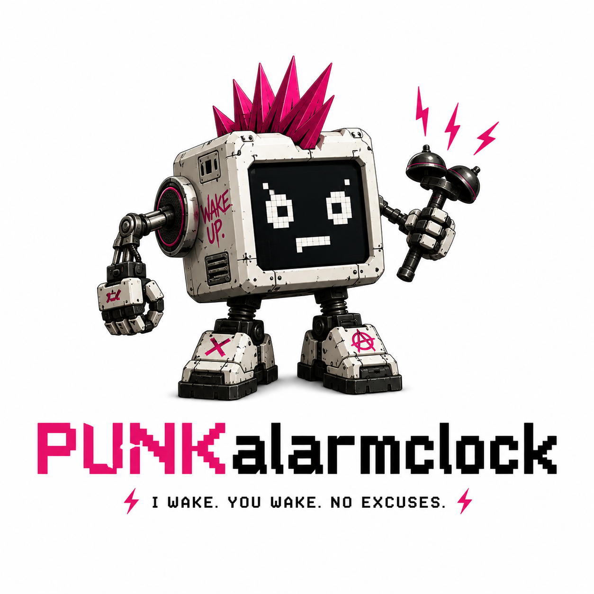

# RobotHelper

<div align="center">
  
</div>

AI-driven **wake-up robot**: it watches via camera, decides when a person is asleep, drives over to wake them, and then reports how groggy they look and how they reacted — streaming everything to a live dashboard.

Built around a **Waveshare UGV Beast** rover controlled via the **Cyberwave SDK**, with an **OpenAI vision model** as the planning brain and **InterHuman** as the emotional-signal sensor. The spoken wake-up line plays through the browser / PC audio.

## Architecture

```
MacBook webcam / rover camera
        |
        v
  +-----------+       +------------------+
  | InterHuman| ----> | OpenAI Vision    |
  | (feelings)|       | (asleep? planner)|
  +-----------+       +------------------+
                             |
                      JSON action plan
                             |
                      +------v-------+
                      | Safety layer |   validate + clamp
                      +------+-------+
                             |
                      +------v-------+
                      | Cyberwave SDK|   move_forward / turn / stop
                      +------+-------+
                             |
                      +------v-------+
                      | UGV Beast    |   digital twin or physical rover
                      +------+-------+
                             |
           +-----------------+-----------------+
           |                                   |
    +------v-------+                    +------v-------+
    | WebSocket    |                    | MQTT broker  |
    +------+-------+                    +--------------+
           |
    +------v--------------------+
    | Next.js dashboard         |
    | - live camera feed        |
    | - wake-up report:         |
    |     phase + grogginess    |
    |     emotional reaction    |
    |     AI summary            |
    | - daily news (ScrapeGraph)|
    | - browser wake-up audio   |
    +---------------------------+
```

## Project Structure

```
robothelper/
  backend/
    server.py               # FastAPI WebSocket server — orchestrator loop + phase machine
    agent/
      planner.py            # OpenAI vision planner (asleep? + wake-up plan + report)
      feelings.py           # InterHuman live-stream client (engagement + social signals)
      drive.py              # Action validation/clamping + Cyberwave UGV executor
      __init__.py
    Go2ManualControl.py     # Legacy Go2 dog REPL (kept for reference)
    requirements.txt
    .env                    # local config (git-ignored)
  robothelper/              # Next.js 16 dashboard (React 19, Tailwind 4)
    app/
      page.tsx              # Main page — camera feed + wake-up report
      layout.tsx
      globals.css
      components/
        VideoFeed.tsx        # Live camera feed with asleep/awake overlay
        WakeReport.tsx       # Phase + grogginess gauge + emotional reaction + AI summary
        NewsFeed.tsx         # Daily news feed (ScrapeGraph), shown once you're awake
      hooks/
        useBackend.ts        # WebSocket hook — frames, detections, agent state
        useCyberwave.ts      # MQTT hook — rover telemetry (unused by the wake-up UI)
    lib/
      cyberwave.ts           # Cyberwave REST/MQTT/WebRTC helpers
    package.json
  cv_model/
    injury_detection.ipynb   # Colab notebook — synthetic data + model training
    inference.py             # Standalone YOLOv8-pose + classifier inference
    generate_graphs.py       # Research-quality figure generation
    model/
      injury_classifier.pkl  # Trained Gradient Boosting classifier
      feature_config.json    # Feature metadata
    graphs/                  # Pre-generated evaluation figures
    README.md
  PIPELINE.md                # Detailed architecture & design rationale
  .gitignore
```

## Prerequisites

- **Python 3.11+**
- **Node.js 20+** and npm
- API keys (all optional — the system degrades gracefully):

| Key | Purpose | Where to get it |
|-----|---------|-----------------|
| `OPENAI_API_KEY` | Vision planner (the "brain") | [platform.openai.com](https://platform.openai.com/api-keys) |
| `INTERHUMAN_API_KEY` | Emotional-signal sensor | [interhuman.ai](https://interhuman.ai) |
| `CYBERWAVE_API_KEY` | Robot control (UGV Beast) | [cyberwave.com](https://cyberwave.com) dashboard |
| `SMALLEST_API_KEY` | Text-to-speech (voice hail) | [smallest.ai](https://smallest.ai) |
| `SCRAPEGRAPH_API_KEY` | Live wildfire news alerts | [scrapegraphai.com](https://scrapegraphai.com) |

## Quick Start

### 1. Backend

```bash
cd backend
python -m venv .venv && source .venv/bin/activate
pip install -r requirements.txt

# Configure (copy and fill in your keys)
cp .env.example .env

# Run the server (macOS will ask for camera permission the first time)
python server.py
# or with mock robot frames:
python server.py --mock
```

The backend starts a FastAPI server on `http://localhost:8000` with:
- `GET  /api/news` — wildfire news (live via ScrapeGraph or dummy fallback)
- `POST /api/tts`  — text-to-speech proxy (smallest.ai)
- `WS   /ws`       — main WebSocket (frames + detections + agent state + feelings)

### 2. Frontend

```bash
cd robothelper
npm install
npm run dev
```

Open [http://localhost:3000](http://localhost:3000). The dashboard connects to the backend WebSocket automatically.

## How It Works

### Wake-Up Pipeline

1. The camera loop grabs frames at ~7 fps from the webcam (or rover camera).
2. Each frame is sent to the **OpenAI vision model** (default: `gpt-4o`) along with a summary of the person's emotional state from InterHuman.
3. The model returns a strict JSON response: `person_present`, `asleep` (bool), `grogginess` (0–100), `assessment`, `reaction_summary`, `say` (a friendly wake-up line), and an `actions` list.
4. The **safety layer** validates and clamps every action against conservative limits (max 1.0 m/step, max 3.14 rad/turn, max 8 actions per plan).
5. If the person is asleep, validated approach actions run **once** via the **Cyberwave SDK** against the UGV Beast (digital twin or physical rover), and the browser speaks the wake-up line via TTS.
6. A small phase machine moves through **scanning → waking → awake**; once awake, the dashboard reports grogginess + emotional reaction. Everything streams over WebSocket.

### InterHuman (Feelings Sensor)

The InterHuman client continuously streams ~4-second video segments to the InterHuman API over a WebSocket. It receives back engagement level, social signals (stress, frustration, hesitation, etc.), and conversation quality. These signals are fed into the planner prompt and surfaced in the report as **how the person reacted to being woken up**.

### YOLOv8 Pre-Filter (Phase 2)

Set `USE_YOLO=true` in `.env` to enable the local YOLOv8-pose + Gradient Boosting classifier as a fast pre-filter before calling OpenAI. This reduces API costs by only sending likely-relevant frames to the vision model.

### Dashboard Features

- **Live camera feed** with an asleep/awake overlay (ASLEEP = violet, AWAKE = green)
- **Wake-up report** with the current phase, a grogginess gauge (0–100), the InterHuman emotional reaction, and an AI natural-language summary
- **Daily news feed** — once you're awake, a box pulls the day's news via **ScrapeGraph** (`NEWS_URL`, defaults to X / Reuters; point it at any outlet)
- **Browser wake-up audio** — the friendly wake-up line plays through the laptop/PC speakers via smallest.ai TTS
- **Keyboard controls** — W/A/S/D or arrow keys to nudge the rover manually

## Configuration

All configuration is done via environment variables in `backend/.env`:

| Variable | Default | Description |
|----------|---------|-------------|
| `OPENAI_API_KEY` | _(none)_ | Required for the AI planner |
| `OPENAI_MODEL` | `gpt-4o` | OpenAI model (vision). On the free tier try `gpt-4o-mini` for more headroom |
| `AGENT_PLAN_INTERVAL` | `4.0` | Seconds between planner calls |
| `AGENT_DRY_RUN` | `false` | Plan without sending movement commands |
| `CYBERWAVE_API_KEY` | _(none)_ | Robot connection |
| `CYBERWAVE_TWIN_UUID` | _(none)_ | UGV Beast twin ID |
| `CYBERWAVE_ENVIRONMENT_ID` | _(none)_ | Cyberwave environment ID |
| `CYBERWAVE_AFFECT` | `simulation` | `simulation` (digital twin) or `live` (physical rover) |
| `INTERHUMAN_API_KEY` | _(none)_ | Feelings sensor |
| `USE_YOLO` | `false` | Enable local YOLO pre-filter (Phase 2) |
| `CAMERA_SOURCE` | `webcam` | `webcam` or `robot` |
| `CAMERA_FPS` | `7` | Target frames per second |
| `SMALLEST_API_KEY` | _(none)_ | Text-to-speech (wake-up line) |
| `SCRAPEGRAPH_API_KEY` | _(none)_ | Daily news feed ([scrapegraphai.com](https://scrapegraphai.com/dashboard/settings)) |
| `NEWS_URL` | `https://lite.cnn.com` | Page ScrapeGraph scrapes for news. JS-friendly news sites work best; X needs a paid plan (see note) |
| `NEWS_STEALTH` | `true` | Try anti-bot fetch first (+5 credits); auto-falls back to plain JS render if unavailable |

### Safety Limits

| Limit | Default | Env var |
|-------|---------|---------|
| Max distance per step | 1.0 m | `DRIVE_MAX_DISTANCE_M` |
| Max angle per turn | 3.14 rad | `DRIVE_MAX_ANGLE_RAD` |
| Max wait duration | 5.0 s | `DRIVE_MAX_DURATION_S` |
| Max actions per plan | 8 | `DRIVE_MAX_ACTIONS` |

## Graceful Degradation

Every external service is optional. The system starts and runs with zero API keys configured:

| Missing key | Behavior |
|-------------|----------|
| `OPENAI_API_KEY` | Planner is "offline" — video still streams, no asleep/awake detection |
| `INTERHUMAN_API_KEY` | Feelings sensor is "offline" — report runs without the emotional reaction |
| `CYBERWAVE_API_KEY` | Robot is "offline" — agent plans the approach but doesn't move; use keyboard to nudge |
| `SMALLEST_API_KEY` | TTS is silent — the wake-up line won't play through the PC audio |
| `SCRAPEGRAPH_API_KEY` | News box shows a sample feed instead of live scraped news |

### API & rate-limit notes (read before a live demo)

- **OpenAI free tier is too small for continuous vision.** Without a payment method, `gpt-4o` is limited to ~**3 requests/min and ~50 requests/day** — a few minutes of running exhausts the day. Fixes: add a payment method at [platform.openai.com/billing](https://platform.openai.com/account/billing) (tier-1 → 500 RPM), and/or set `OPENAI_MODEL=gpt-4o-mini` and raise `AGENT_PLAN_INTERVAL`. When throttled, the planner **backs off automatically** and the report shows a `rate-limited` banner instead of erroring.
- **ScrapeGraph keys are v2.** `sgai-…` keys only work on `v2-api.scrapegraphai.com` (the legacy `api.scrapegraphai.com/v1` host returns 403). `stealth` is a paid-plan fetch provider; `X` needs JS render + stealth for fresh posts, so the default `NEWS_URL` is a JS-friendly news site that returns today's headlines on the free plan.

## CV Model (Standalone)

> Legacy / optional. The wake-up flow uses the OpenAI vision planner for asleep/awake
> detection. This local pose pipeline (lying-down vs upright) is kept as an optional
> `USE_YOLO=true` pre-filter and a standalone demo.

The `cv_model/` directory contains a standalone pose-classification pipeline that can run independently:

```bash
cd cv_model
pip install ultralytics scikit-learn opencv-python joblib

# Live webcam demo
python inference.py

# Video file
python inference.py --source path/to/video.mp4

# Single image
python inference.py --source path/to/image.jpg
```

The pipeline uses YOLOv8-pose to extract 17 body keypoints per person, computes 11 geometric features (body angle, aspect ratio, vertical spread, etc.), and classifies each person as OK or INJURED using a trained Gradient Boosting model.

## Known Limitations

- **InterHuman is video-only** — adding microphone audio would improve voice-based signals (stress/annoyance after waking).
- The wake-up line plays through the **browser/PC speakers**, not an on-board robot speaker.
- Only locomotion verbs are used (`move_forward`, `move_backward`, `turn_left`, `turn_right`, `stop`). Camera-servo and lights are available on the UGV but not wired up yet.

## License

This project is not currently licensed for distribution.
